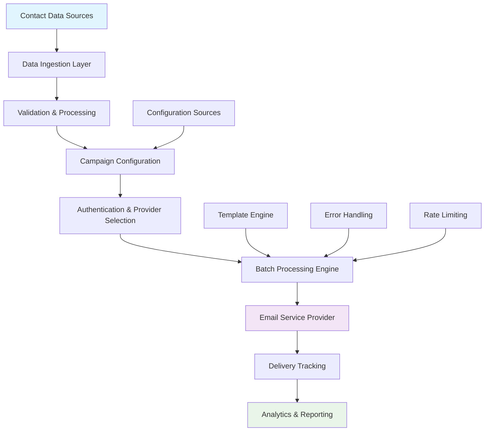
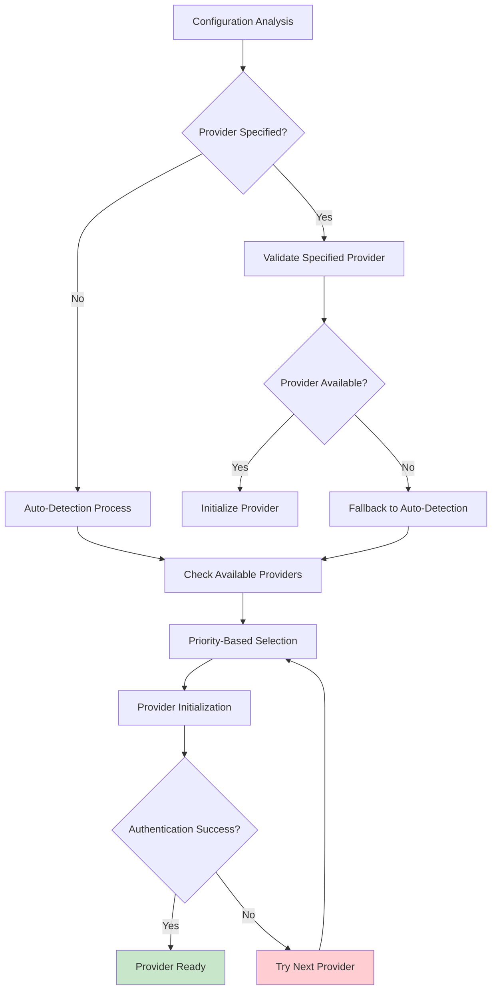
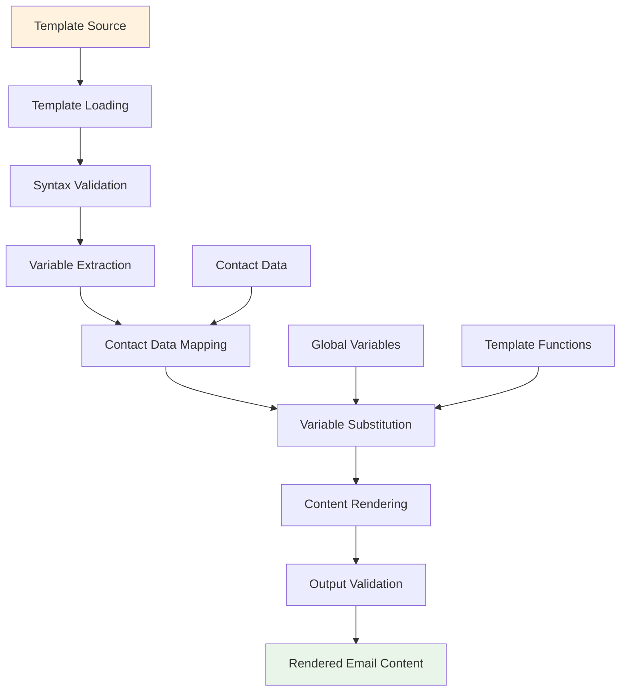
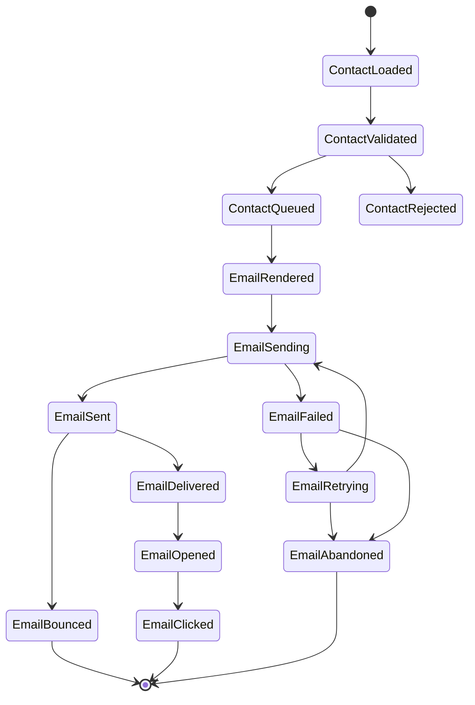

# Data Flow Architecture

Comprehensive documentation of data flow patterns, processing pipelines, and information movement throughout the TierII Email Campaign system.

## 📋 Overview

The TierII system processes data through multiple interconnected pipelines, from contact ingestion to email delivery and analytics collection. This document details how data flows through each component and the transformations that occur at each stage.

## 🔄 High-Level Data Flow



## 📊 Data Processing Pipelines

### 1. Contact Data Pipeline

#### Input Sources
- **CSV Files**: Primary contact data source
- **Database**: Alternative structured data source
- **API Endpoints**: Real-time contact data
- **Manual Input**: Single contact processing

#### Processing Stages

```python
# Contact Data Flow Example
def process_contact_data(source_type: str, source_config: Dict) -> List[Dict[str, Any]]:
    """
    Contact data processing pipeline.
    
    Flow:
    1. Raw Data Ingestion
    2. Format Detection & Parsing
    3. Schema Validation
    4. Data Cleaning & Normalization
    5. Duplicate Detection & Removal
    6. Contact Dictionary Creation
    7. Validation & Error Handling
    """
    
    # Stage 1: Raw Data Ingestion
    raw_data = data_loader.load_raw_data(source_type, source_config)
    
    # Stage 2: Format Detection & Parsing
    parsed_data = data_parser.parse_data(raw_data)
    
    # Stage 3: Schema Validation
    validated_data = schema_validator.validate(parsed_data)
    
    # Stage 4: Data Cleaning & Normalization
    cleaned_data = data_cleaner.clean_and_normalize(validated_data)
    
    # Stage 5: Duplicate Detection & Removal
    deduplicated_data = deduplicator.remove_duplicates(cleaned_data)
    
    # Stage 6: Contact Dictionary Creation
    contacts = [create_contact_dict(item) for item in deduplicated_data]
    
    # Stage 7: Final Validation
    valid_contacts = [c for c in contacts if is_valid_contact(c)]
    
    return valid_contacts

def create_contact_dict(data: Dict) -> Dict[str, Any]:
    """Create a contact dictionary from raw data."""
    return {
        'email': data.get('email', '').strip().lower(),
        'first_name': data.get('first_name', '').strip(),
        'last_name': data.get('last_name', '').strip(),
        'company': data.get('company', '').strip(),
        'position': data.get('position', '').strip()
    }

def is_valid_contact(contact: Dict[str, Any]) -> bool:
    """Validate contact dictionary."""
    return '@' in contact.get('email', '') and '.' in contact.get('email', '')
```

#### Data Transformations

| Stage | Input Format | Output Format | Transformations |
|-------|-------------|---------------|-----------------|
| Ingestion | Raw CSV/JSON/DB | Python Dict | Parsing, encoding detection |
| Validation | Python Dict | Validated Dict | Schema validation, type checking |
| Cleaning | Validated Dict | Normalized Dict | Email normalization, name formatting |
| Deduplication | Normalized Dict | Unique Dict | Hash-based duplicate removal |
| Dictionary Creation | Unique Dict | Contact Dict | Dictionary creation, validation |

### 2. Campaign Configuration Pipeline

#### Configuration Sources Priority
1. **Environment Variables** (Highest priority)
2. **Configuration Files** (.env, config.yaml)
3. **Command Line Arguments**
4. **Default Values** (Lowest priority)

#### Configuration Flow

```python
def load_campaign_configuration() -> Dict[str, Any]:
    """
    Configuration loading and validation pipeline.
    
    Flow:
    1. Environment Variable Loading
    2. Configuration File Processing
    3. Command Line Argument Parsing
    4. Configuration Merging & Priority Resolution
    5. Validation & Type Conversion
    6. Default Value Application
    7. Configuration Dictionary Creation
    """
    
    # Stage 1: Load from multiple sources
    env_config = load_environment_variables()
    file_config = load_configuration_files()
    cli_config = parse_command_line_arguments()
    
    # Stage 2: Merge with priority
    merged_config = merge_configurations([
        env_config,      # Highest priority
        cli_config,
        file_config,
        default_config   # Lowest priority
    ])
    
    # Stage 3: Validate and convert types
    validated_config = validate_configuration(merged_config)
    
    # Stage 4: Return configuration dictionary
    return validated_config
```

### 3. Authentication & Provider Selection Pipeline

#### Provider Selection Flow



#### Authentication Data Flow

```python
def authenticate_provider(provider_name: str = None) -> AuthProvider:
    """
    Provider authentication pipeline.
    
    Flow:
    1. Provider Selection/Detection
    2. Configuration Validation
    3. Credential Loading
    4. Authentication Attempt
    5. Connection Testing
    6. Capability Assessment
    7. Provider Registration
    """
    
    # Stage 1: Provider Selection
    if provider_name:
        provider_class = get_provider_class(provider_name)
    else:
        provider_class = auto_detect_provider()
    
    # Stage 2: Configuration Validation
    config = validate_provider_config(provider_class.required_config)
    
    # Stage 3: Credential Loading
    credentials = load_provider_credentials(provider_class.credential_fields)
    
    # Stage 4: Provider Initialization
    provider = provider_class(config, credentials)
    
    # Stage 5: Authentication
    auth_result = provider.authenticate()
    if not auth_result.success:
        raise AuthenticationError(auth_result.error)
    
    # Stage 6: Connection Testing
    connection_test = provider.test_connection()
    if not connection_test.success:
        logger.warning(f"Connection test failed: {connection_test.error}")
    
    # Stage 7: Capability Assessment
    capabilities = provider.get_capabilities()
    logger.info(f"Provider capabilities: {capabilities}")
    
    return provider
```

### 4. Email Processing Pipeline

#### Batch Processing Flow

```python
def process_email_campaign(contacts: List[Dict[str, Any]], config: Dict[str, Any]) -> Dict[str, Any]:
    """
    Email campaign processing pipeline.
    
    Flow:
    1. Contact Batching
    2. Template Processing
    3. Personalization
    4. Rate Limiting
    5. Email Sending
    6. Response Processing
    7. Error Handling
    8. Progress Tracking
    """
    
    campaign_result = {
        'total_contacts': len(contacts),
        'successful_sends': 0,
        'failed_sends': 0,
        'errors': [],
        'start_time': datetime.now(),
        'end_time': None
    }
    
    # Stage 1: Contact Batching
    batches = create_contact_batches(contacts, config['batch_size'])
    
    for batch_num, batch in enumerate(batches):
        logger.info(f"Processing batch {batch_num + 1}/{len(batches)}")
        
        # Stage 2: Template Processing
        template = load_and_validate_template(config['template_path'])
        
        for contact in batch:
            try:
                # Stage 3: Personalization
                personalized_content = personalize_template(template, contact)
                
                # Stage 4: Rate Limiting
                rate_limiter.wait_if_needed()
                
                # Stage 5: Email Sending
                send_result = email_provider.send_email(
                    to_email=contact['email'],
                    subject=personalized_content['subject'],
                    content=personalized_content['body']
                )
                
                # Stage 6: Response Processing
                if send_result.get('success', False):
                    campaign_result['successful_sends'] += 1
                else:
                    campaign_result['failed_sends'] += 1
                    campaign_result['errors'].append({
                        'contact': contact['email'],
                        'error': send_result.get('error', 'Unknown error')
                    })
                
                # Stage 7: Progress Tracking
                progress_tracker.update_progress(
                    sent=campaign_result['successful_sends'],
                    failed=campaign_result['failed_sends'],
                    total=len(contacts)
                )
                
            except Exception as e:
                # Stage 8: Error Handling
                error_handler.handle_send_error(contact, e)
                campaign_result['failed_sends'] += 1
                campaign_result['errors'].append({
                    'contact': contact['email'],
                    'error': str(e)
                })
        
        # Inter-batch delay
        if batch_num < len(batches) - 1:
            time.sleep(config['batch_delay'])
    
    return campaign_result
```

#### Email Data Structure

```python
@dataclass
class EmailData:
    """Email data structure throughout processing pipeline."""
    
    # Contact Information
    recipient_email: str
    recipient_name: str
    contact_data: Dict[str, Any]
    
    # Email Content
    subject: str
    html_content: str
    text_content: Optional[str] = None
    
    # Metadata
    campaign_id: str
    batch_id: str
    template_id: str
    personalization_data: Dict[str, Any] = field(default_factory=dict)
    
    # Processing Status
    processing_stage: str = "created"
    processing_timestamp: datetime = field(default_factory=datetime.utcnow)
    
    # Send Results
    send_attempt_count: int = 0
    last_send_result: Optional[Dict[str, Any]] = None
    delivery_status: str = "pending"
    
    def to_send_request(self) -> Dict[str, Any]:
        """Convert to email provider send request format."""
        return {
            'to': self.recipient_email,
            'subject': self.subject,
            'html': self.html_content,
            'text': self.text_content,
            'metadata': {
                'campaign_id': self.campaign_id,
                'batch_id': self.batch_id,
                'contact_data': self.contact_data
            }
        }
```

### 5. Template Processing Pipeline

#### Template Data Flow



#### Template Processing Implementation

```python
def process_email_template(template_path: str, contact: Dict[str, Any], global_vars: Dict = None) -> Dict[str, Any]:
    """
    Template processing pipeline.
    
    Flow:
    1. Template Loading & Caching
    2. Syntax Validation
    3. Variable Extraction & Analysis
    4. Data Context Preparation
    5. Variable Substitution
    6. Content Rendering
    7. Output Validation & Sanitization
    """
    
    # Stage 1: Template Loading
    template_content = template_cache.get_or_load(template_path)
    
    # Stage 2: Syntax Validation
    template_validator.validate_syntax(template_content)
    
    # Stage 3: Variable Extraction
    required_vars = template_analyzer.extract_variables(template_content)
    
    # Stage 4: Data Context Preparation
    context = prepare_template_context(contact, global_vars, required_vars)
    
    # Stage 5: Variable Substitution
    rendered_content = template_engine.render(template_content, context)
    
    # Stage 6: Content Rendering
    email_content = parse_rendered_content(rendered_content)
    
    # Stage 7: Output Validation
    validate_email_content(email_content)
    
    return {
        'subject': email_content.subject,
        'html_body': email_content.html,
        'text_body': email_content.text,
        'metadata': email_content.metadata
    }

def prepare_template_context(contact: Dict[str, Any], global_vars: Dict, required_vars: List[str]) -> Dict[str, Any]:
    """Prepare comprehensive template context."""
    
    context = {
        # Contact-specific data
        'contact': contact,
        'email': contact.get('email', ''),
        'first_name': contact.get('first_name', ''),
        'last_name': contact.get('last_name', ''),
        'full_name': f"{contact.get('first_name', '')} {contact.get('last_name', '')}".strip(),
        
        # Global variables
        **(global_vars or {}),
        
        # System variables
        'campaign_date': datetime.now().strftime('%Y-%m-%d'),
        'unsubscribe_url': generate_unsubscribe_url(contact.get('email', '')),
        
        # Utility functions
        'format_date': lambda d, fmt='%Y-%m-%d': d.strftime(fmt) if d else '',
        'format_currency': lambda amount: f"${amount:,.2f}",
        'capitalize': lambda s: s.capitalize() if s else '',
    }
    
    # Validate all required variables are available
    missing_vars = [var for var in required_vars if var not in context]
    if missing_vars:
        raise TemplateError(f"Missing required variables: {missing_vars}")
    
    return context
```

### 6. Error Handling & Recovery Pipeline

#### Error Processing Flow

```python
class ErrorHandler:
    """Centralized error handling and recovery system."""
    
    def __init__(self, config: ErrorHandlingConfig):
        self.config = config
        self.error_queue = []
        self.retry_queue = []
        
    def handle_error(self, error: Exception, context: Dict[str, Any]) -> ErrorAction:
        """
        Error handling pipeline.
        
        Flow:
        1. Error Classification
        2. Severity Assessment
        3. Recovery Strategy Selection
        4. Retry Logic Application
        5. Logging & Notification
        6. Fallback Execution
        """
        
        # Stage 1: Error Classification
        error_type = classify_error(error)
        
        # Stage 2: Severity Assessment
        severity = assess_error_severity(error, context)
        
        # Stage 3: Recovery Strategy Selection
        strategy = select_recovery_strategy(error_type, severity)
        
        # Stage 4: Retry Logic
        if strategy.should_retry:
            return self.schedule_retry(error, context, strategy)
        
        # Stage 5: Logging & Notification
        self.log_error(error, context, severity)
        if severity >= ErrorSeverity.HIGH:
            self.send_notification(error, context)
        
        # Stage 6: Fallback Execution
        if strategy.has_fallback:
            return self.execute_fallback(error, context, strategy)
        
        return ErrorAction.FAIL
```

### 7. Analytics & Monitoring Pipeline

#### Data Collection Flow

```python
def collect_campaign_analytics(campaign_id: str) -> CampaignAnalytics:
    """
    Analytics data collection and processing pipeline.
    
    Flow:
    1. Event Data Aggregation
    2. Metric Calculation
    3. Performance Analysis
    4. Trend Detection
    5. Report Generation
    6. Data Persistence
    """
    
    # Stage 1: Event Data Aggregation
    events = event_collector.get_campaign_events(campaign_id)
    
    # Stage 2: Metric Calculation
    metrics = calculate_campaign_metrics(events)
    
    # Stage 3: Performance Analysis
    performance = analyze_campaign_performance(metrics)
    
    # Stage 4: Trend Detection
    trends = detect_performance_trends(campaign_id, metrics)
    
    # Stage 5: Report Generation
    report = generate_analytics_report(metrics, performance, trends)
    
    # Stage 6: Data Persistence
    analytics_store.save_campaign_analytics(campaign_id, report)
    
    return report

def calculate_campaign_metrics(events: List[CampaignEvent]) -> CampaignMetrics:
    """Calculate comprehensive campaign metrics."""
    
    send_events = [e for e in events if e.type == 'email_sent']
    open_events = [e for e in events if e.type == 'email_opened']
    click_events = [e for e in events if e.type == 'email_clicked']
    bounce_events = [e for e in events if e.type == 'email_bounced']
    
    total_sent = len(send_events)
    successful_sends = len([e for e in send_events if e.success])
    
    return CampaignMetrics(
        total_emails=total_sent,
        successful_sends=successful_sends,
        failed_sends=total_sent - successful_sends,
        opens=len(open_events),
        clicks=len(click_events),
        bounces=len(bounce_events),
        
        # Calculated rates
        delivery_rate=(successful_sends / max(total_sent, 1)) * 100,
        open_rate=(len(open_events) / max(successful_sends, 1)) * 100,
        click_rate=(len(click_events) / max(successful_sends, 1)) * 100,
        bounce_rate=(len(bounce_events) / max(total_sent, 1)) * 100,
        
        # Timing metrics
        average_send_time=calculate_average_send_time(send_events),
        campaign_duration=calculate_campaign_duration(events)
    )
```

## 🔄 Data State Management

### State Transitions



### State Persistence

```python
class CampaignStateManager:
    """Manage campaign and email state throughout processing."""
    
    def __init__(self, storage_backend: str = "file"):
        self.storage = create_storage_backend(storage_backend)
        self.state_cache = {}
        
    def update_contact_state(self, contact_id: str, new_state: ContactState):
        """Update contact processing state."""
        state_record = {
            'contact_id': contact_id,
            'state': new_state.value,
            'timestamp': datetime.utcnow().isoformat(),
            'metadata': new_state.metadata
        }
        
        self.storage.save_state_record(state_record)
        self.state_cache[contact_id] = new_state
        
    def get_campaign_state_summary(self, campaign_id: str) -> Dict[str, int]:
        """Get summary of all contact states in campaign."""
        states = self.storage.get_campaign_states(campaign_id)
        
        summary = {}
        for state in ContactState:
            summary[state.value] = len([s for s in states if s['state'] == state.value])
            
        return summary
        
    def recover_failed_contacts(self, campaign_id: str) -> List[str]:
        """Get list of contacts that can be retried."""
        failed_states = [ContactState.EMAIL_FAILED, ContactState.EMAIL_RETRYING]
        
        recoverable = []
        for state in failed_states:
            contacts = self.storage.get_contacts_by_state(campaign_id, state)
            recoverable.extend([c['contact_id'] for c in contacts])
            
        return recoverable
```

## 📊 Performance Optimization

### Data Flow Optimization Strategies

1. **Batch Processing**: Process contacts in configurable batches
2. **Parallel Processing**: Concurrent email sending within rate limits
3. **Caching**: Template and configuration caching
4. **Streaming**: Memory-efficient contact data streaming
5. **Connection Pooling**: Reuse HTTP connections to email providers

### Memory Management

```python
class MemoryEfficientProcessor:
    """Process large contact lists with minimal memory usage."""
    
    def __init__(self, batch_size: int = 100):
        self.batch_size = batch_size
        
    def process_contacts_streaming(self, contact_source: Iterator[List[Dict[str, Any]]]) -> Iterator[Dict[str, Any]]:
        """Process contacts in memory-efficient streaming mode."""
        
        for batch in contact_source:
            # Process batch
            batch_results = []
            
            for contact in batch:
                # Process individual contact
                result = self.process_single_contact(contact)
                batch_results.append(result)
                
                # Clear contact from memory immediately
                del contact
                
            # Yield batch results
            yield {'batch_results': batch_results}
            
            # Clear batch from memory
            del batch
            del batch_results
```

## 🔍 Monitoring & Observability

### Data Flow Monitoring

```python
class DataFlowMonitor:
    """Monitor data flow throughout the system."""
    
    def __init__(self):
        self.metrics_collector = MetricsCollector()
        self.flow_tracer = FlowTracer()
        
    def trace_data_flow(self, data_id: str, stage: str, metadata: Dict = None):
        """Trace data through processing stages."""
        trace_event = {
            'data_id': data_id,
            'stage': stage,
            'timestamp': datetime.utcnow().isoformat(),
            'metadata': metadata or {}
        }
        
        self.flow_tracer.record_event(trace_event)
        
    def collect_flow_metrics(self, stage: str, duration: float, success: bool):
        """Collect performance metrics for each stage."""
        self.metrics_collector.record_metric(
            name=f"stage_{stage}_duration",
            value=duration,
            tags={'success': success}
        )
        
    def get_flow_health_status(self) -> Dict[str, Any]:
        """Get overall data flow health status."""
        return {
            'active_flows': self.flow_tracer.get_active_flow_count(),
            'average_processing_time': self.metrics_collector.get_average_duration(),
            'error_rate': self.metrics_collector.get_error_rate(),
            'throughput': self.metrics_collector.get_throughput()
        }
```

## 📚 Related Documentation

- **[Architecture Overview](overview.md)** - High-level system architecture
- **[Extensibility Guide](extensibility.md)** - Adding new components and providers
- **[Development Guide](../guides/development.md)** - Development workflow and patterns
- **[Testing Guide](../guides/testing.md)** - Testing data flow and pipelines

---

**Data Flow Version**: 0.1.0  
**Pipeline Architecture**: Event-driven with state management  
**Processing Model**: Batch processing with streaming support